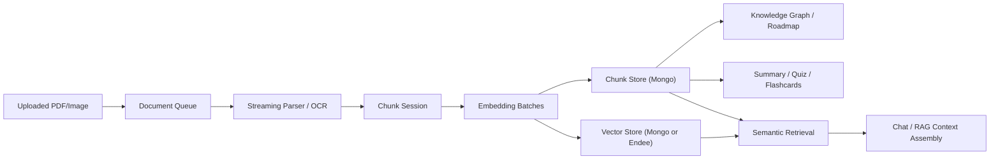

# YAILA

YAILA is a MERN-based AI learning platform for document chat, summaries, flashcards, quizzes, knowledge graphs, and learning roadmaps.

This repo now includes a production-ready large-document ingestion and retrieval upgrade:

- page-batched PDF parsing instead of full-document extraction first
- resumable ingestion with checkpoints
- batched embeddings and batched chunk writes
- optional Endee vector database integration for semantic search
- Mongo-backed fallback vector search for backward compatibility
- metadata-aware retrieval with document/page/section traceability
- a retrieval API for semantic search and RAG context inspection

## Architecture



## Repo layout

- `backend`
- `frontend`

YAILA keeps the Node/Express app structure. Endee is vendored under `backend/vendor/endee` and integrated as an optional HTTP vector backend behind a clean adapter layer in the backend.

## Backend setup

```bash
cd backend
npm install
cp .env.example .env
npm run dev
```

Core env knobs live in:

- `backend/.env.example`

Important settings:

- `VECTOR_STORE_PROVIDER=mongo|endee`
- `INGESTION_PAGE_BATCH_SIZE`
- `INGESTION_CHUNK_BATCH_SIZE`
- `EMBEDDING_BATCH_SIZE`
- `INGESTION_CHECKPOINT_ENABLED`
- `INGESTION_USE_AI_CHUNK_SUMMARIES`
- `RETRIEVAL_TOP_K`
- `RETRIEVAL_CONTEXT_RADIUS`

### Running with Endee

Default behavior stays backward compatible with Mongo vector search:

```env
VECTOR_STORE_PROVIDER=mongo
```

To use Endee:

```env
VECTOR_STORE_PROVIDER=endee
ENDEE_BASE_URL=http://localhost:8080
ENDEE_AUTH_TOKEN=
ENDEE_INDEX_NAME=document-chunks
ENDEE_SPACE_TYPE=cosine
ENDEE_PRECISION=int16
```

Endee source is vendored under:

- `backend/vendor/endee`

Use Endee’s own build/run docs there if you want the external vector DB path. If Endee is unavailable, YAILA still keeps Mongo chunk records and can fall back to Mongo vector retrieval.

## Frontend setup

```bash
cd frontend
npm install
npm run dev
```

Frontend env:

```env
VITE_API_URL=http://localhost:5001/api
```

## Large-document ingestion flow

For PDFs in the 1000–2000 page range, the backend now:

1. Reads page counts first.
2. Parses pages in batches instead of loading the whole PDF into memory.
3. Removes repeated boilerplate where detectable.
4. Builds chunks incrementally with deterministic chunk indexes.
5. Embeds chunks in batches.
6. Writes chunks in bulk to Mongo.
7. Indexes vectors in bulk to Mongo or Endee.
8. Saves progress checkpoints so failed jobs can resume.

Checkpoint state is stored in:

- `backend/models/DocumentIngestionCheckpoint.js`

## Retrieval and RAG

Semantic retrieval is unified in:

- `backend/services/retrievalService.js`

Vector backends:

- `backend/services/vectorStores/mongoVectorStore.js`
- `backend/services/vectorStores/endeeVectorStore.js`

The chat flow uses hybrid retrieval:

- semantic candidates
- lexical candidates
- rerank
- near-duplicate filtering
- optional adjacent context expansion

### Retrieval API

You can inspect the semantic retrieval path directly:

```bash
POST /api/ai/retrieve
```

Request body:

```json
{
  "query": "Explain biconditional logic",
  "documentIds": ["<document-id>"],
  "topK": 4
}
```

## Tests

```bash
cd backend
npm test
```

Current tests cover:

- chunking behavior
- resumable chunk-session state
- local embedding fallback
- Endee adapter indexing/search hydration
- retrieval merging and de-duplication

## Benchmark

Run the synthetic large-document benchmark:

```bash
cd backend
npm run benchmark:ingestion
```

Optional knobs:

```bash
BENCHMARK_PAGE_COUNT=1500 BENCHMARK_PARAGRAPHS_PER_PAGE=6 npm run benchmark:ingestion
```

## Key backend files

- `backend/services/documentIngestionService.js`
- `backend/services/chunkingService.js`
- `backend/utils/pdfParser.js`
- `backend/services/retrievalService.js`
- `backend/services/vectorStores/vectorStoreFactory.js`
- `backend/controllers/aiController.js`

## Notes

- Mongo remains the default vector path for easy local startup.
- Endee is integrated cleanly but optional.
- OCR stays opt-in and is not used by default for PDFs with an existing text layer.
- The ingestion path preserves document/page/section metadata for downstream study features.
