# YAILA

YAILA is an AI learning workspace for your own study documents.

You upload a PDF, the backend processes it into searchable chunks, and then you can study from the same material using chat, summary, flashcards, quiz, concept graph, and roadmap views.

Demo link: _I will add this later._

## What this project does

- Upload and process documents
- Ask document-grounded questions in AI Chat
- Generate and read structured summaries
- Practice with flashcards and quizzes
- Explore concept relationships in a knowledge graph
- Follow a generated learning roadmap
- Track activity on dashboard/profile pages

## Product tour

### Login

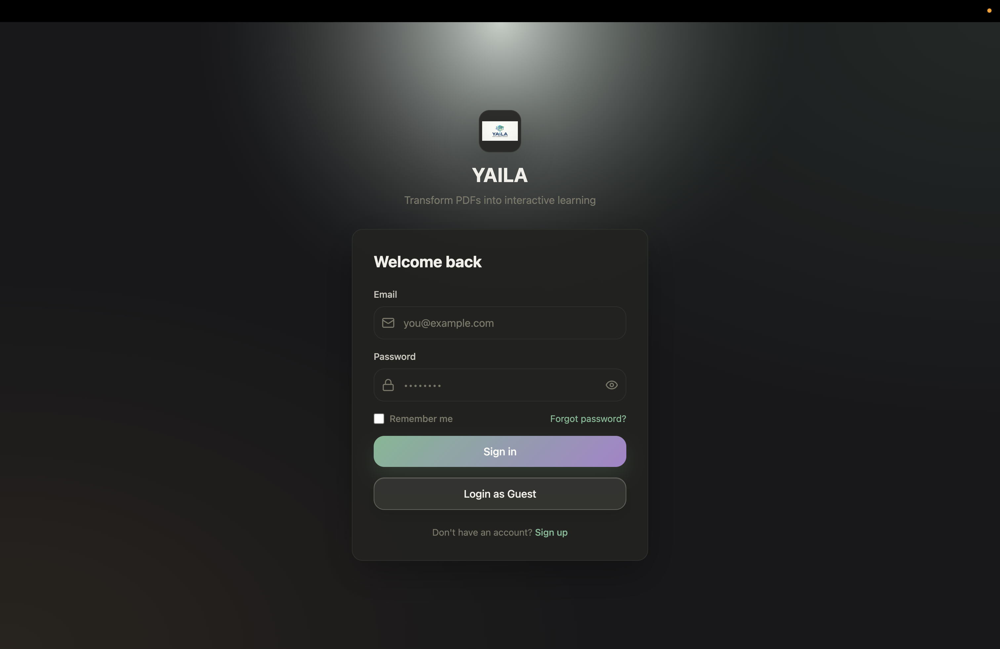

### Dashboard

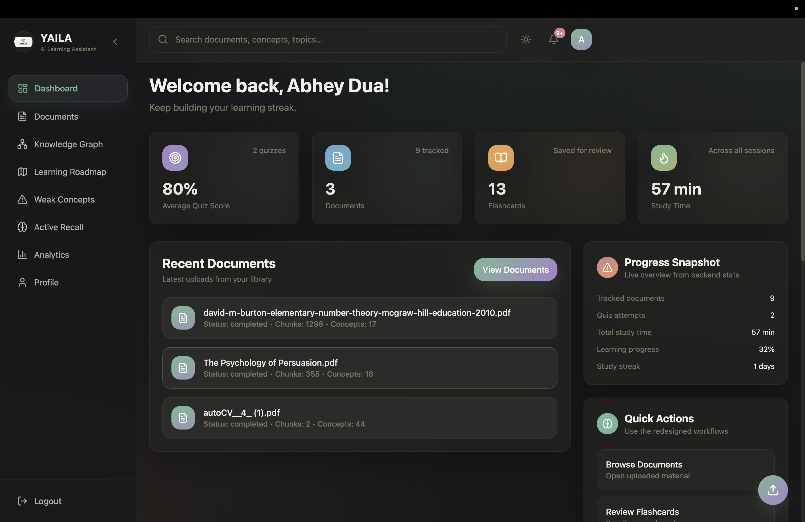

### Documents

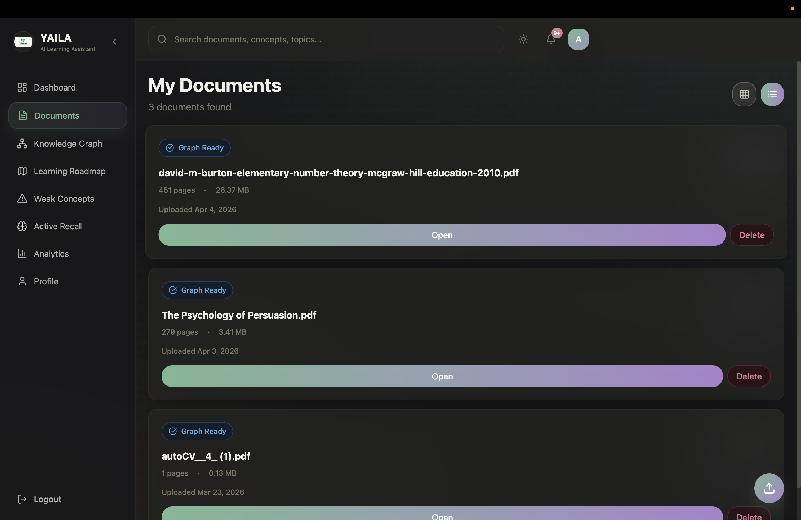

### Upload modal

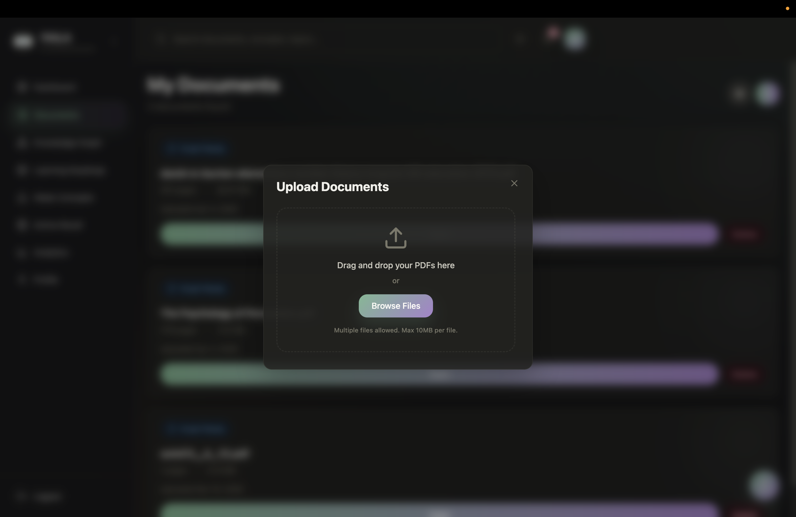

### Document workspace: AI Chat

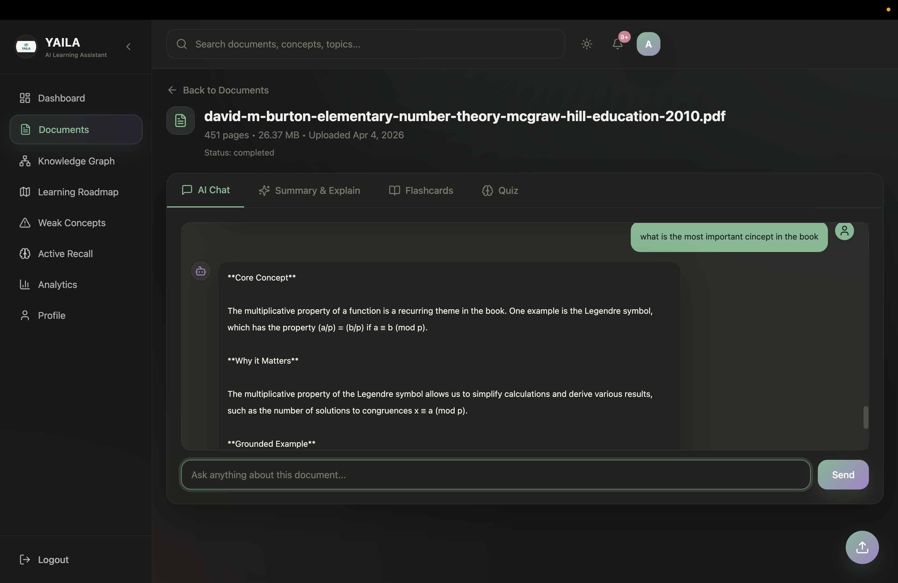

### Document workspace: Summary

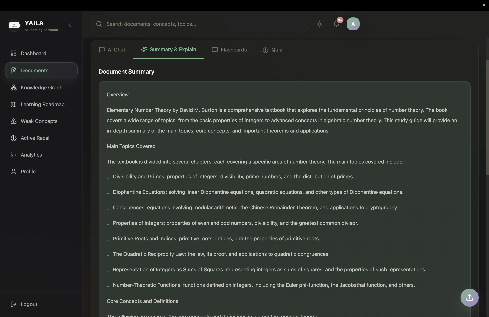

### Document workspace: Flashcards

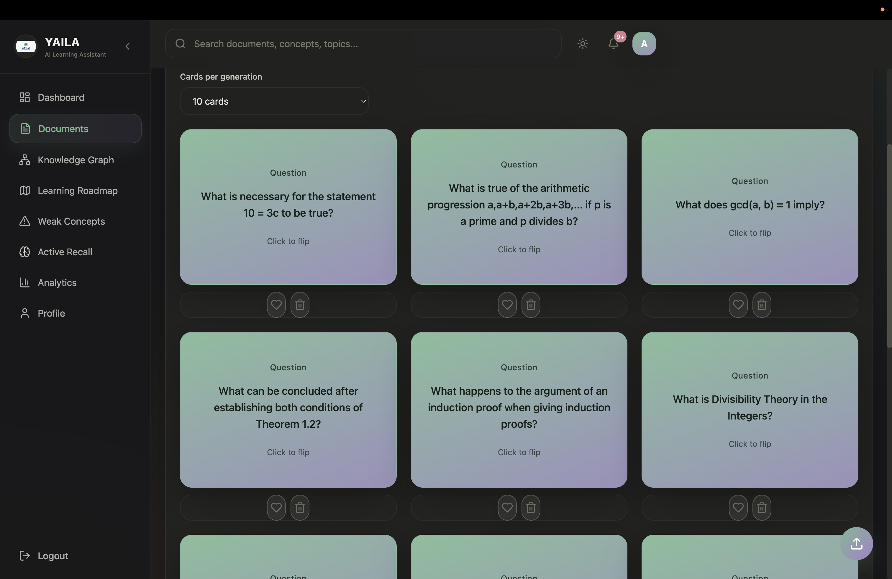

### Document workspace: Quiz

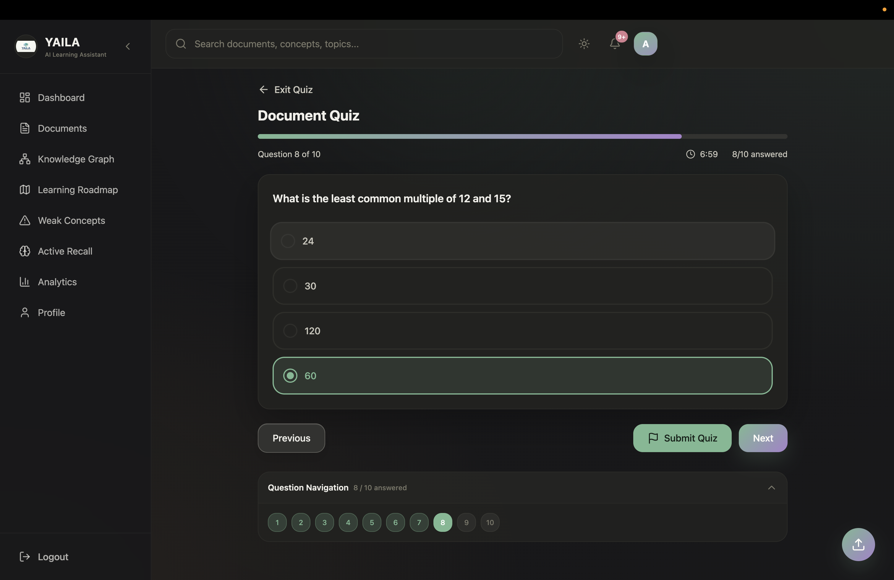

### Knowledge Graph

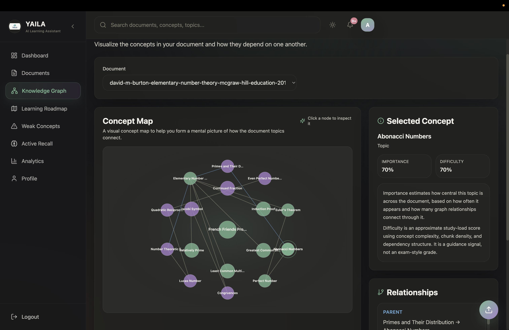

### Learning Roadmap

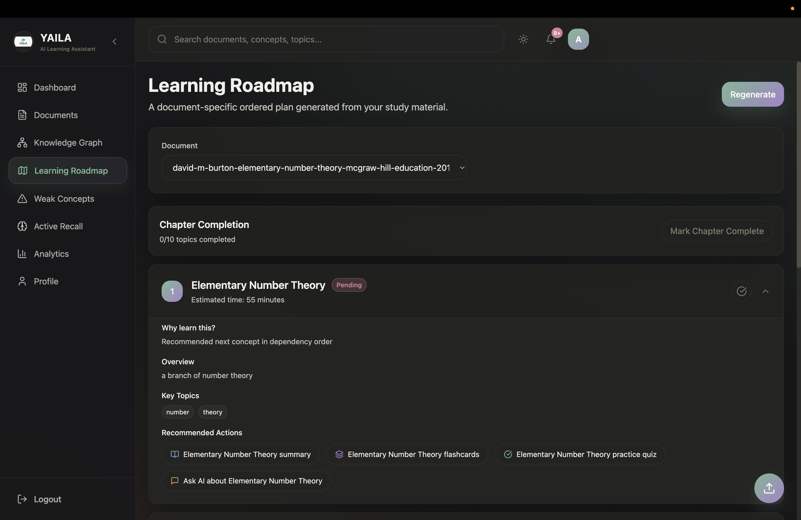

### Profile

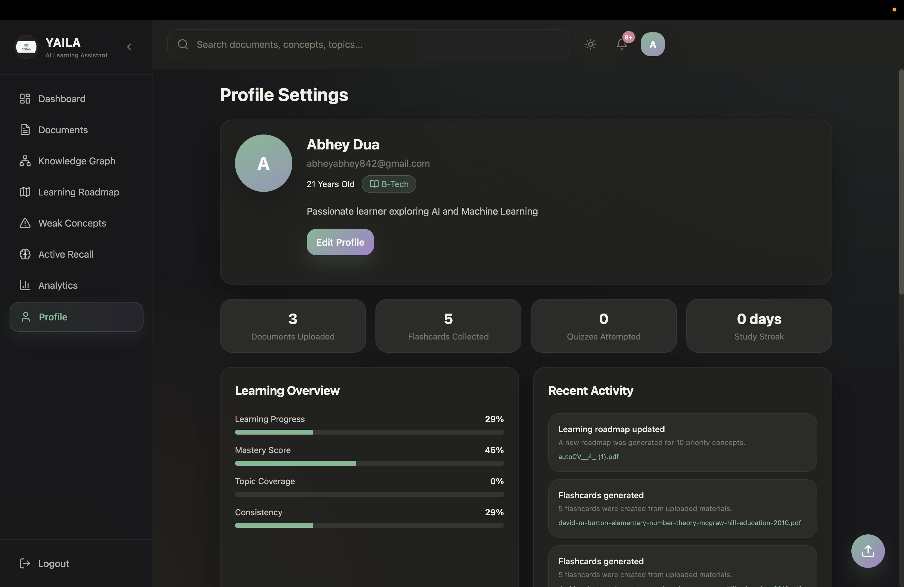

## Architecture (UML)

This project is React + Express + MongoDB, with configurable AI/vector providers.

```mermaid
flowchart LR
    U[User] --> FE[Frontend (React + Vite)]
    FE --> API[Backend API (Express)]

    API --> DB[(MongoDB)]
    API --> LLM[LLM Provider (Groq/Gemini)]
    API --> VEC[Vector Store (Mongo/Endee)]

    API --> INGEST[Ingestion Service]
    INGEST --> PARSER[PDF Parser]
    PARSER --> CHUNKER[Chunking]
    CHUNKER --> EMBED[Embeddings]
    EMBED --> DB
    EMBED --> VEC

    API --> CHAT[Chat + Tutor Orchestrator]
    CHAT --> RETRIEVE[Retrieval Service]
    RETRIEVE --> DB
    RETRIEVE --> VEC

    API --> SUMMARY[Summary Service]
    API --> FLASH[Flashcard Service]
    API --> QUIZ[Quiz Service]
    API --> GRAPH[Knowledge Graph Service]
    API --> ROADMAP[Roadmap Service]
```

## UML: document ingestion sequence

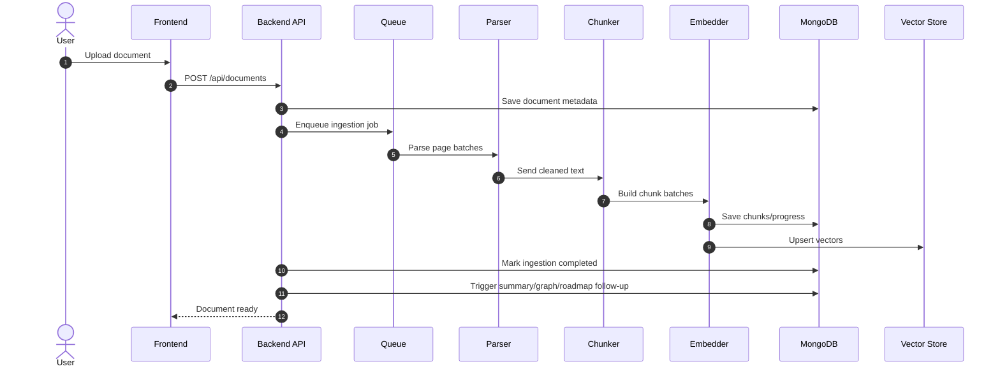
```mermaid
sequenceDiagram
    autonumber
    actor User
    participant FE as Frontend
    participant API as Backend API
    participant Q as Queue
    participant P as Parser
    participant C as Chunker
    participant E as Embedder
    participant DB as MongoDB
    participant VS as Vector Store

    User->>FE: Upload document
    FE->>API: POST /api/documents
    API->>DB: Save document metadata
    API->>Q: Enqueue ingestion job

    Q->>P: Parse page batches
    P->>C: Send cleaned text
    C->>E: Build chunk batches
    E->>DB: Save chunks/progress
    E->>VS: Upsert vectors

    API->>DB: Mark ingestion completed
    API->>DB: Trigger summary/graph/roadmap follow-up
    API-->>FE: Document ready
```

## UML: chat retrieval flow

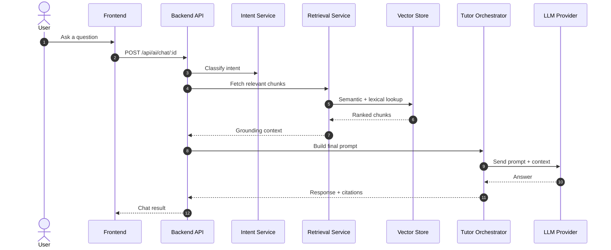
```mermaid
sequenceDiagram
    autonumber
    actor User
    participant FE as Frontend
    participant API as Backend API
    participant I as Intent Service
    participant R as Retrieval Service
    participant VS as Vector Store
    participant O as Tutor Orchestrator
    participant LLM as LLM Provider

    User->>FE: Ask a question
    FE->>API: POST /api/ai/chat/:id
    API->>I: Classify intent
    API->>R: Fetch relevant chunks
    R->>VS: Semantic + lexical lookup
    VS-->>R: Ranked chunks
    R-->>API: Grounding context
    API->>O: Build final prompt
    O->>LLM: Send prompt + context
    LLM-->>O: Answer
    O-->>API: Response + citations
    API-->>FE: Chat result
```

## Core flow

1. User logs in (or guest login).
2. User uploads a document from Documents page.
3. Backend parses, chunks, embeds, and indexes it.
4. Document opens in a multi-tab workspace (chat/summary/flashcards/quiz).
5. User can continue with graph and roadmap views.

## Project structure

```text
backend/
  config/
  controllers/
  jobs/
  middleware/
  models/
  repositories/
  routes/
  services/
  tests/
  utils/
  vendor/endee/

frontend/
  public/
    readme/
  src/app/
  src/services/

README.md
```

## Main backend modules

- `backend/services/documentIngestionService.js`
- `backend/services/chunkingService.js`
- `backend/services/retrievalService.js`
- `backend/services/chatService.js`
- `backend/services/tutorOrchestratorService.js`
- `backend/services/summaryService.js`
- `backend/services/quizService.js`
- `backend/services/knowledgeGraphService.js`
- `backend/services/roadmapService.js`

## Main frontend modules

- `frontend/src/app/routes.tsx`
- `frontend/src/app/context/AuthContext.tsx`
- `frontend/src/services/api.js`
- `frontend/src/app/pages/DocumentDetail.tsx`
- `frontend/src/app/pages/KnowledgeGraph.tsx`
- `frontend/src/app/pages/LearningRoadmap.tsx`

## API groups

- `/api/auth`
- `/api/documents`
- `/api/ai`
- `/api/flashcards`
- `/api/quizzes`
- `/api/graph`
- `/api/roadmaps`
- `/api/dashboard`
- `/api/activity`
- `/api/notifications`

## Local setup

Backend:

```bash
cd backend
npm install
cp .env.example .env
npm run dev
```

Frontend:

```bash
cd frontend
npm install
npm run dev
```

## Important env variables

From `backend/.env.example`:

- `AI_PRIMARY_PROVIDER`
- `AI_FALLBACK_PROVIDER`
- `VECTOR_STORE_PROVIDER`
- `DOCUMENT_UPLOAD_MAX_MB`
- `INGESTION_PAGE_BATCH_SIZE`
- `EMBEDDING_BATCH_SIZE`
- `RETRIEVAL_TOP_K`
- `RESUME_INGESTION_ON_BOOT`

## Health, tests, benchmark

- Health: `GET /api/health`
- AI health: `GET /api/ai/test`

Run tests:

```bash
cd backend
npm test
```

Run ingestion benchmark:

```bash
cd backend
npm run benchmark:ingestion
```
